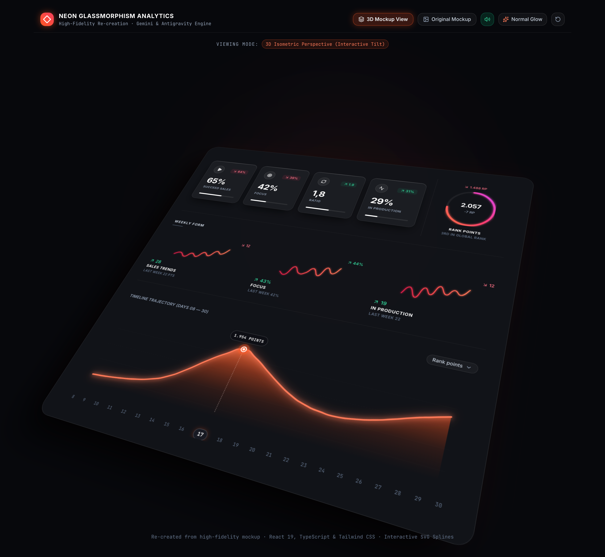
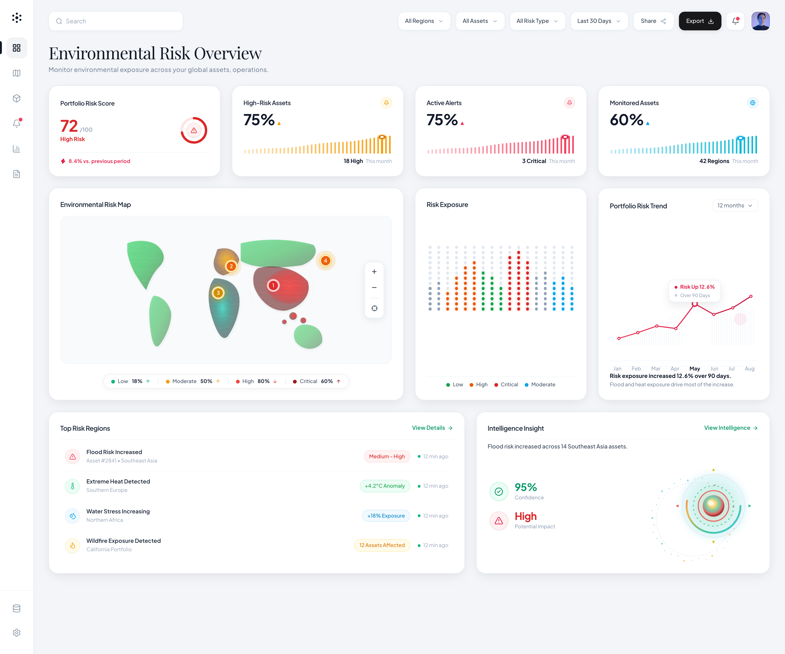
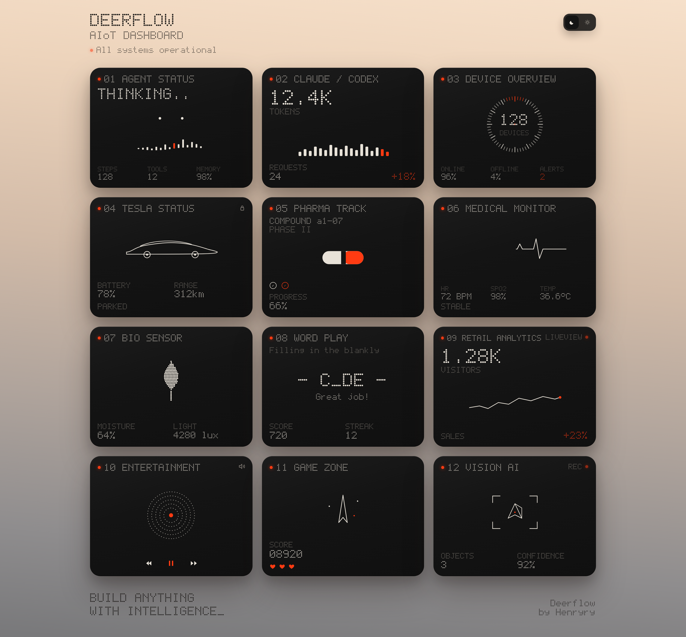
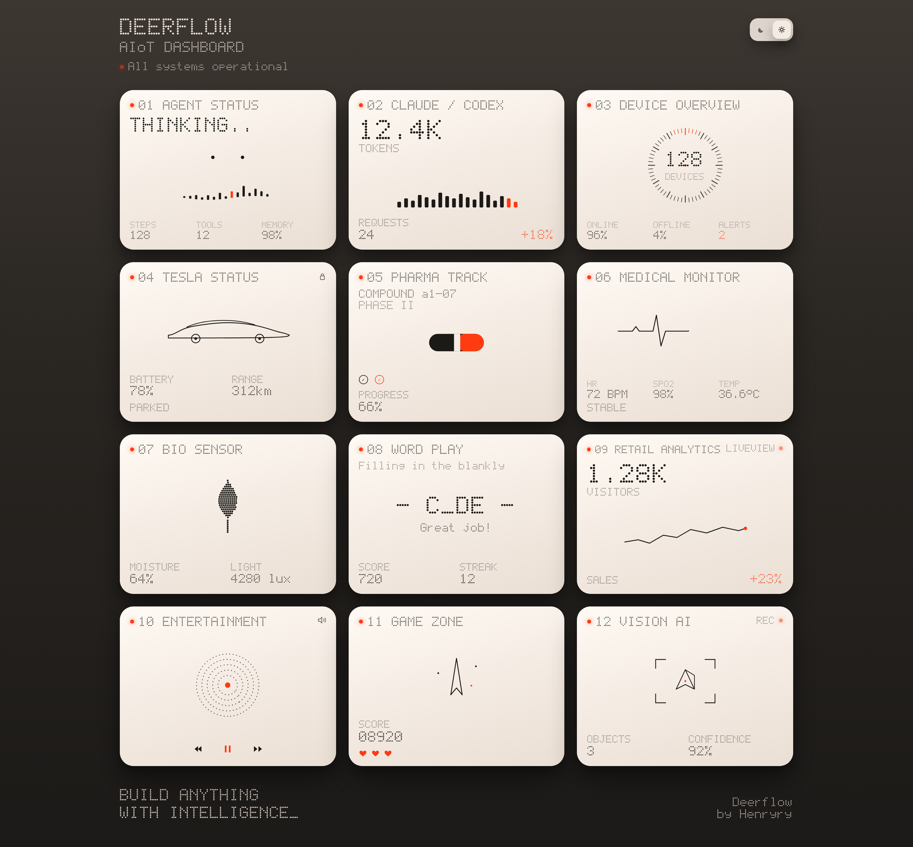
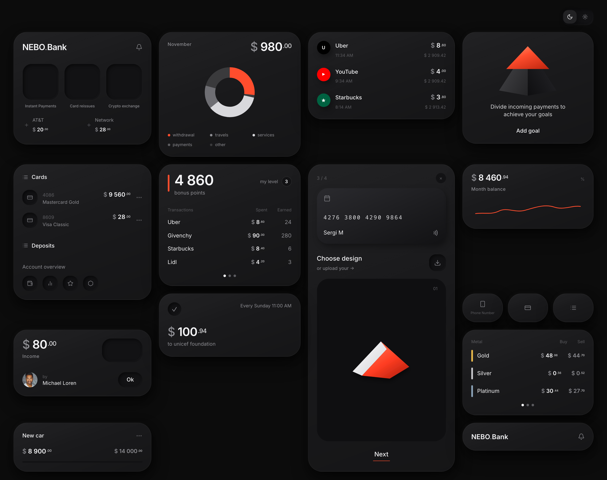
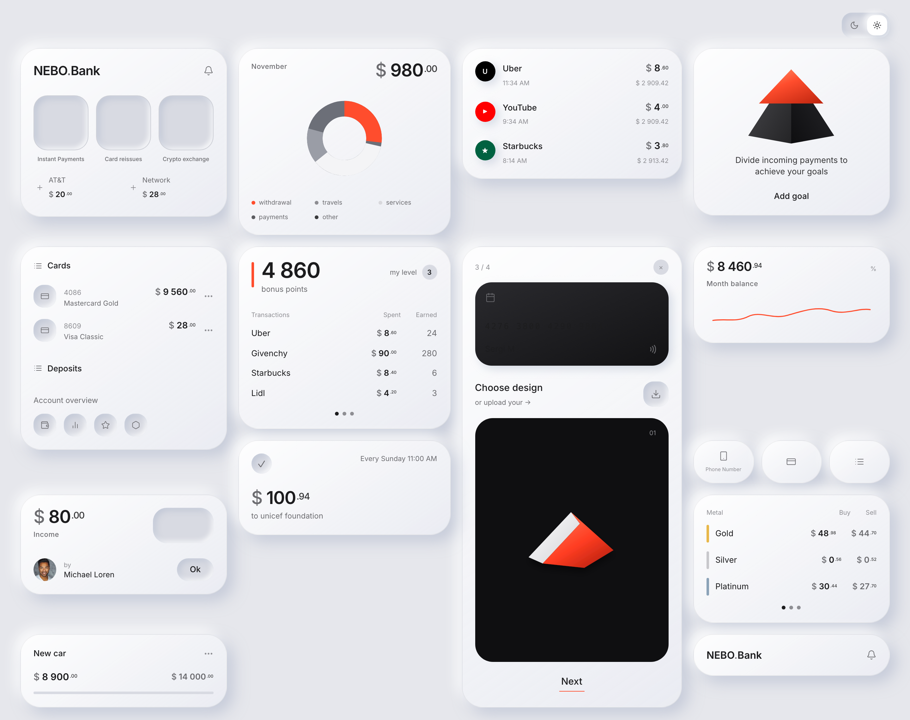

# dashboard-mx

Mockups of dashboards. Each folder is a self-contained Vite + React + TypeScript + Tailwind app.

## Dashboards

### Neon Glassmorphism Analytics

[`neon-analytics-dashboard/`](./neon-analytics-dashboard/) — isometric glassmorphic analytics board with SVG splines, rank gauge, and 3D tilt.



```bash
cd neon-analytics-dashboard && npm install && npm run dev
```

Runs at http://localhost:5174/

### Environmental Risk Overview

[`e-risk-dashboard/`](./e-risk-dashboard/) — editorial risk operations board: KPI cards, relief map, exposure matrix, trend chart, and intelligence orb.



```bash
cd e-risk-dashboard && npm install && npm run dev
```

Runs at http://localhost:3000/

### Deerflow AIoT

[`deerflow-dashboard/`](./deerflow-dashboard/) — studio-lit 12-tile AIoT board with reconstructed dot-matrix type. Dark (reference) and paired light theme.

**Dark**



**Light**



```bash
cd deerflow-dashboard && npm install && npm run dev
```

Runs at http://localhost:5176/

### NEBO.Bank

[`nebo-bank-dashboard/`](./nebo-bank-dashboard/) — neumorphic fintech mosaic with cards, payments, goals, and metals. Dark (reference) and paired light theme.

**Dark**



**Light**



```bash
cd nebo-bank-dashboard && npm install && npm run dev
```

Runs at http://localhost:5175/
